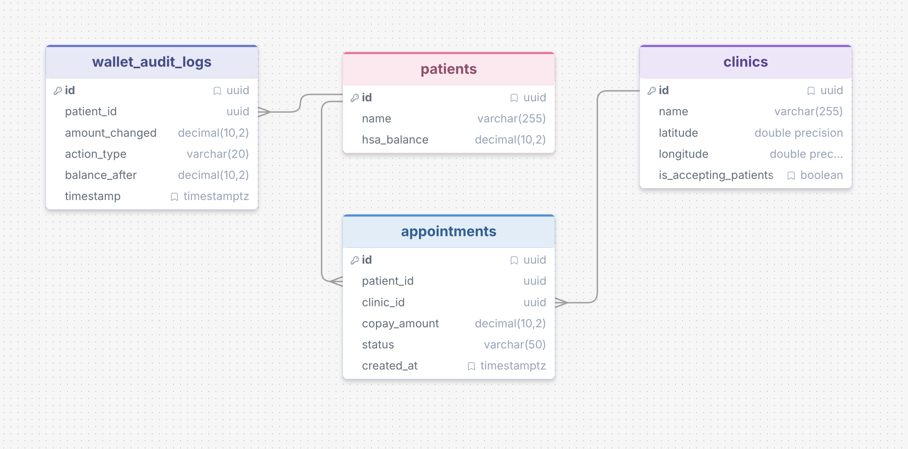

# SSD-A1-Project-4-CareConnect

---

## Step 1: Database Setup

### Creating PostgreSQL Tables

#### Overview

This step creates the PostgreSQL tables required for the project.

#### File

- `01_schema_ddl.sql`

#### Executing the File

```bash
psql -d careconnect -f sql/01_schema_ddl.sql
```




### Creating MongoDB Collections

#### Overview

This step creates the MongoDB collections required for the project.

#### File

- `01_collections_and_indexes.js`

#### Executing the File

```bash
mongosh mongo/01_collections_and_indexes.js
```

---


## Step 2: Database-Heavy Engineering Tasks

---


## Step 3: Complex Database Workflows (Pure Scripts)


### Workflow 2 – SQL Window Analytics


#### Overview

Workflow 2 reports a 7 day moving average of copay revenue for every clinic and
ranks the clinics against each other on each day using `DENSE_RANK()`.

The query is built out of CTEs and runs against the PostgreSQL tables created in
`01_schema_ddl.sql`.

#### What counts as revenue

Only appointments with status `DISCHARGED` are counted, since the copay is
earned once the visit is finished. This is the same rule
`clinic_monthly_discharges` already uses in `05_materialized_views.sql`.

#### How the 7 day window is built

A clinic does not see patients every single day, and an average that quietly
skipped the empty days would make a clinic that opened twice in a week look just
as strong as one that opened every day. So the query first builds a calendar
with one row per clinic per day across the whole reporting range, fills the
missing days with `0.00`, and only then averages over
`ROWS BETWEEN 6 PRECEDING AND CURRENT ROW`. Because the calendar has no holes,
those 7 rows are always 7 calendar days.

`DENSE_RANK()` is used instead of `RANK()` so that when two clinics land on the
same average they share a position and the next clinic down still gets the next
number rather than having one skipped.

#### Output columns


| Column               | Meaning                                                                          |
| -------------------- | -------------------------------------------------------------------------------- |
| `revenue_date`       | the day being reported                                                           |
| `clinic_name`        | the clinic                                                                       |
| `daily_revenue`      | copay taken that day, `0.00` if the clinic was quiet                             |
| `rolling_total_7day` | copay taken over that day and the 6 days before it                               |
| `moving_avg_7day`    | `rolling_total_7day` divided by `days_in_window`, to 2 decimals                  |
| `days_in_window`     | how many days the average covers, below 7 only for the first 6 days of the range |
| `clinic_rank`        | position among all clinics that day by `moving_avg_7day`, ties share a rank      |


#### Files

Two files were added for workflow 2:

- `06_seed_window_analytics.sql` (test data only, needs to be removed before final submission)
- `06_window_analytics.sql`


#### Executing Workflow 2

```bash
psql -d careconnect -f sql/04_seed_window_analytics.sql
psql -d careconnect -f sql/04_window_analytics.sql
```

The seed script empties the four tables before it inserts, so do not point it at
data you want to keep.

#### What the seed data covers

The seeded rows are chosen so the interesting cases are all visible in the
output rather than having to be imagined:

- Northside takes two copays on 3 March, and they are added together into one
daily figure of 200.00.
- Northside has a 400.00 appointment on 5 March that is still `IN_CONSULTATION`,
and it stays out of the report.
- Riverside and Lakeview both take 700.00 on 5 March and nothing else that week,
so they sit tied on the same rank every day from 5 March to 15 March.
- On 12 March that 700.00 drops off the back of the window and both fall to
0.00, which shows the window really is sliding.
- Hilltop has never discharged anyone, so it stays at 0.00 and ranks last.
- The first six days show `days_in_window` climbing from 1 to 7.


#### A note on dates

`created_at` is a `TIMESTAMPTZ`, so which calendar day a copay falls into
depends on the session time zone. The seed timestamps are written without an
offset, so PostgreSQL reads them in whatever time zone the session happens to be
using and the query then buckets them back the same way. Running both files in
the same session gives the same answer no matter where it is run.

### Workflow 3 – Nearest Mobile Nurse


#### Overview

Workflow 3 uses MongoDB's `$geoNear` aggregation stage to locate the
nearest active mobile nurse to a patient's current coordinates.

The workflow operates on the `NursePings` collection in the
`careconnect_db` database.

#### MongoDB Setup

The `NursePings` collection uses a `2dsphere` index on the `location`
field for geospatial queries.
That is already done in Step 2.

#### NursePing Document Structure

Test NursePing documents use the following structure:

```javascript
{
    nurse_id: "N001",
    active: true,
    location: {
        type: "Point",
        coordinates: [longitude, latitude]
    },
    created_at: new Date()
}
```

Also we have two files for this workflow 3

- `02_seed_nurse_pings.js`
- `02_workflow3_geonear.js`

To add a sample test data for nurse pings you can run the following command (This is seeding script ONLY TO BE USED FOR LOCAL TESTING, AND NOT TO INCLUDE IN FINAL PROJECT):

```bash
mongosh mongo/02_seed_nurse_pings.js
```

And then for retrieving the nearest active nurses you can run the following command (This is the script that uses `$geoNear` to retrieve the nearest active nurses that have pinged recently):

```bash
mongosh mongo/02_workflow3_geonear.js
```

Also I have HARD-CODED current patient location, that you will be able to see in `02_workflow3_geonear.js`  

You can add your test datas in this collection and run this retrieving script for more testing.

### Workflow 4 – Multi-Faceted Review Analytics


#### Overview

Workflow 4 uses MongoDB's `$facet` aggregation stage to simultaneously extract rating buckets, determine frequent sentiment tags using the `$unwind` operator, and calculate the global average rating across the platform.

The workflow operates on the `PatientReviews` collection in the `careconnect_db` database.

#### MongoDB Setup

The `PatientReviews` collection utilizes standard indexes on fields like `clinic_id` and `rating` to optimize the aggregation pipeline operations. 

#### PatientReview Document Structure

Test PatientReview documents use the following structure:

```javascript

{

    appointment_id: "A001",

    clinic_id: "C001",

    patient_id: "P001",

    rating: 5,

    bedside_manner_tags: ["empathetic", "punctual", "clear-instructions"],

    review_text: "Great experience.",

    created_at: new Date()

}
```


#### Executing Workflow 4:

I have added two files for workflow 4:

- `03_seed_workflow4.js` (temporary, need to be removed before final submission)
- `03_workflow4_facet.js`

Run the following commands to test workflow 4:

```bash
mongosh mongo/03_seed_workflow4.js
mongosh mongo/03_workflow4_facet.js
```

---


## Step 4: Data Generation & Stress Testing


### Seeding MongoDB Collections

This process populates the unstructured NoSQL collections with high-volume mock data to prove the indexing and aggregation pipelines work at scale. It utilizes Python and the Faker library.

**Prerequisites**
Install the necessary Python dependencies for database connections and data mocking:

```bash
pip install -r data_generation/requirements.txt
```

To seed the MongoDB collections, run the following command:

```bash
python data_generation/mongo_seeder_1.py
```

This will seed the `MedicalCatalogs` and `PatientReviews` collections with 1000 documents each.

### Seeding PostgreSQL Tables

`data_generation/postgres_seeder.py` fills the four relational tables with
enough rows to clear the assignment's volume requirement:

| Table               | Rows    |
| ------------------- | ------- |
| `clinics`           | 250     |
| `patients`          | 25,000  |
| `appointments`      | 60,000  |
| `wallet_audit_logs` | 116,000 or so |

The exact ledger count moves a little because the number of movements per
patient is random, but the script will not finish below 100,000.

#### Prerequisites

The script needs `psycopg2-binary` and `Faker`, both of which are in
`data_generation/requirements.txt`:

```bash
pip install -r data_generation/requirements.txt
```

The tables, the partial index, the audit trigger and the materialized view all
have to exist first, so run steps 1 and 2 before seeding:

```bash
createdb careconnect
psql -d careconnect -f sql/01_schema_ddl.sql
psql -d careconnect -f sql/02_indexes.sql
psql -d careconnect -f sql/03_triggers_and_audit.sql
psql -d careconnect -f sql/05_materialized_views.sql
```

#### Running it

```bash
python data_generation/postgres_seeder.py
```

It connects to `dbname=careconnect` on the local socket. To point it anywhere
else, set `CARECONNECT_DSN`:

```bash
CARECONNECT_DSN="dbname=careconnect host=localhost user=postgres" python data_generation/postgres_seeder.py
```

The script truncates all four tables before it loads, so do not run it against
a database holding anything you want to keep. It takes roughly 90 seconds.

#### How the wallet ledger is built

The audit table is the one place in this schema where random numbers would be
actively wrong: `balance_after` is supposed to be the balance the patient was
left with, so it has to follow from the movement before it.

So the script does not generate audit rows independently. It walks each patient
forward through their own sequence of movements, starting from an opening
balance and applying credits and debits in date order, and writes out
`balance_after` at each step. The balance the patient ends on is what goes into
`patients.hsa_balance`. Debits are never allowed to take a patient below zero,
which is the same rule the `CHECK (hsa_balance >= 0.00)` constraint enforces.

Those rows go in with `COPY`, which is fast but bypasses the trigger in
`03_triggers_and_audit.sql` completely. To exercise the real path as well, the
last phase updates `patients.hsa_balance` for 4,000 patients and lets the
trigger write those audit rows itself. Those are the only rows in the table the
script never inserts directly.

#### Data shape

- Appointments are spread over the last 18 months. About 90% are `DISCHARGED`,
which is what `clinic_monthly_discharges` and the workflow 2 moving average
both read.
- The remaining `WAITING` and `IN_CONSULTATION` appointments all go to distinct
patients and are dated within the last two days. The partial unique index from
`02_indexes.sql` allows only one open appointment per patient, so seeding two
for the same patient would fail the load.
- Clinics are scattered around eight metro areas rather than uniformly over the
globe, so distance between clinics means something. Around 8% are marked as not
accepting patients, which is the branch `create_appointment_atomic()` rejects.
- `random.seed()` and `Faker.seed()` are both fixed, so two people running this
against a fresh database get the same rows.

#### Verification

The script checks its own work before exiting and prints the result of each
check. It exits non-zero if any of them fail:

```
verifying...
  [ok] clinics: 250
  [ok] patients: 25000
  [ok] appointments (>= 50,000): 60000
  [ok] wallet_audit_logs (>= 100,000): 116655
  [ok] patients holding more than one open appointment: 0
  [ok] negative balances: 0
  [ok] audit rows with a non positive amount: 0
  [ok] patients whose latest audit row disagrees with hsa_balance: 0
  [ok] orphaned audit rows: 0
  ...  CREDIT: 41,556
  ...  DEBIT: 75,099
  ...  DISCHARGED: 54,000
  ...  IN_CONSULTATION: 2,973
  ...  WAITING: 3,027
  ...  ledger covers 2025-03-12 to 2026-09-03
```

The last balance check is the one worth reading. It goes to the newest audit row
for every patient and confirms its `balance_after` is the balance that patient
is actually sitting on, which is the only thing that makes the table a ledger
rather than a pile of numbers.

The script also runs `ANALYZE` and refreshes `clinic_monthly_discharges` on the
way out. The `ANALYZE` matters: without it the planner is still working off
empty-table statistics and any `EXPLAIN` taken straight after the load describes
a database that no longer exists.
